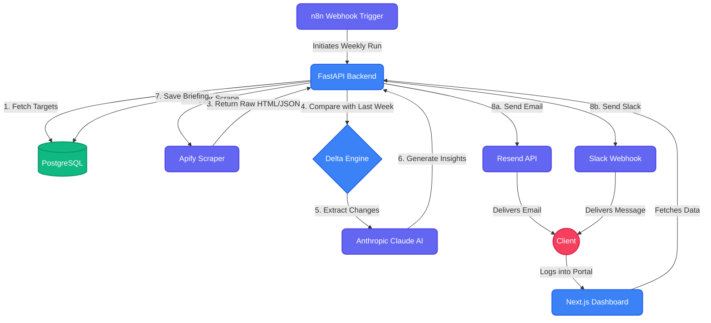

<div align="center">
  
  <h1 align="center">Competitor Intelligence Monitor AI</h1>
  
  <p align="center">
    <strong>Fully automated AI Agent that tracks competitors, calculates weekly deltas, and delivers executive briefings.</strong>
  </p>

  <p align="center">
    <a href="https://github.com/avuzmal/competitor.intelligence.monitor.ai/actions"></a>
    <a href="https://github.com/avuzmal/competitor.intelligence.monitor.ai/stargazers"></a>
    <a href="https://github.com/avuzmal/competitor.intelligence.monitor.ai/network/members"></a>
    <a href="https://github.com/avuzmal/competitor.intelligence.monitor.ai/issues"></a>
  </p>
</div>

<hr />

## 🌟 Overview

The **Competitor Intelligence Monitor AI** is a production-ready SaaS template built to provide high-level, automated competitive intelligence.

It orchestrates scraping competitor websites, calculating structural changes ("deltas"), analyzing those changes with LLMs (Claude), and delivering polished, actionable briefings directly to clients via Email, Slack, and a modern Web Portal.

### Key Features
- 🤖 **AI Delta Engine**: Automatically detects precise week-over-week changes in competitor websites.
- 🧠 **Claude Integration**: Synthesizes raw data into structured, strategic business insights.
- ✉️ **Multi-Channel Delivery**: Beautiful HTML emails (via Resend) and Slack Webhook integration.
- 💳 **Stripe Billing**: Built-in subscription management for B2B clients.
- 💻 **Premium Client Portal**: A Next.js 14 frontend utilizing Shadcn UI for a pristine user experience.

## 🏗 Architecture & Data Pipeline

The system is designed as an asynchronous, event-driven pipeline that moves data from raw HTML scrapes to executive summaries.



---


## 🛠 Tech Stack

| Domain | Technology |
|---|---|
| **Backend API** | FastAPI (Python 3.11+) |
| **Frontend Portal** | Next.js 14, Tailwind CSS, Shadcn UI |
| **Database & ORM** | PostgreSQL, SQLAlchemy 2.0, Alembic |
| **Data Orchestration** | Apify Python SDK, n8n (Webhooks) |
| **AI / LLM** | Anthropic Claude SDK, Pydantic V2 (Structured JSON) |
| **Infrastructure** | Docker, Docker Compose |

---

## 🚀 Quick Start (Local Development)

The easiest way to run the entire backend stack locally is via Docker.

### 1. Clone the repository
```bash
git clone https://github.com/avuzmal/competitor.intelligence.monitor.ai.git
cd competitor.intelligence.monitor.ai
```

### 2. Environment Variables
Copy the example environment file and fill in your API keys (Apify, Anthropic, Resend, Stripe).
```bash
cp .env.example .env
```

### 3. Spin up the Backend Stack
```bash
docker compose up --build
```
The FastAPI backend will be available at `http://localhost:8000`.

### 4. Run the Frontend (Client Portal)
```bash
cd frontend
npm install
npm run dev
```
The portal will be available at `http://localhost:3000`.

---

## 🤝 Contributing

We welcome contributions! Please follow these steps to contribute:
1. Check the [Issues](https://github.com/avuzmal/competitor.intelligence.monitor.ai/issues) tab for outstanding bugs or feature requests.
2. Fork the repository.
3. Create a feature branch (`git checkout -b feature/amazing-feature`).
4. Commit your changes (`git commit -m 'Add amazing feature'`).
5. Push to the branch (`git push origin feature/amazing-feature`).
6. Open a **Pull Request** using our PR template.

See `.github/PULL_REQUEST_TEMPLATE.md` for our review guidelines.

---

## 📄 License

This project is licensed under the MIT License - see the LICENSE file for details.
